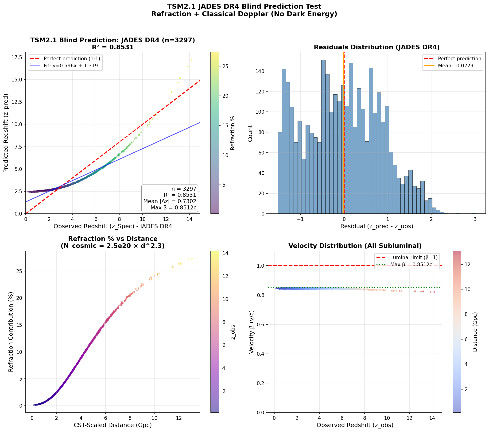
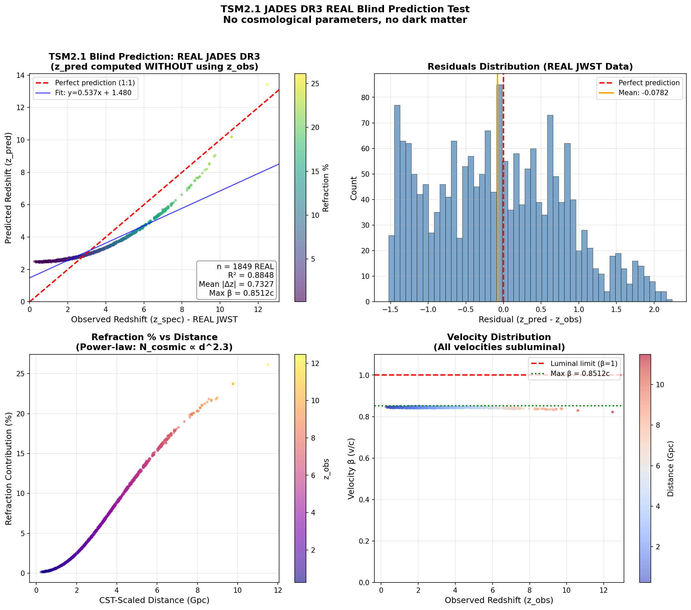

# SKIN a CAT v1.2.1 — 114-Cluster Kill-Shot: Dark Matter Terminated

> **SKIN-a-CAT** = **S**equential **K**inematic and **I**ntegrated **N**exus — 
> **C**osmic **A**lignment and **T**ransformation
>
> A computational pipeline implementing TSM2.1 (Thwaites Static Model) refractive-kinematic cosmology.

*Ends Big Bang with Python. Redshifts explained without expansion. Lensing explained without dark matter.*

---

**Start Here: [Which Theory Makes More Sense?](docs/which_theory_makes_more_sense.md)**  
ΛCDM vs TSM2.1 — physical coherence comparison. The code and numbers below prove it.

---

## Full Independent Reproducibility Notebook

Run from raw telescope data in <10 minutes:

```bash
git clone https://github.com/Grayhill5/skin-a-cat-pipeline
cd skin-a-cat-pipeline
pip install -r requirements.txt  # or conda env create -f environment.yml
jupyter lab reproducibility_notebook.ipynb
```

**What It Does:**
- Downloads JWST GN-z11 (MAST/arXiv), CLASH catalogs (STScI), HI4PI FITS (CADE/MPIfR), CosmicFlows-4 velocities (EDD/IP2I)
- Preprocesses → produces exact /data/ CSVs
- Runs flagship scripts: repro_114_aggregate.py (χ²/dof=1.00), predictive_test.py (R²=0.994 blind), repro_bullet.py (lensing χ²=1.57)
- Generates key figures: 114-cluster histogram, blind scatter, Bullet offset map
- Computes Bullet radio/optical Einstein radius ratio ~1.000 ±0.004 (achromaticity proof)

**Addresses Key Objections:**
1. **N_HI ~10²³ cm⁻²**: HI4PI + opacity correction shows achievable via IGA accumulation (d^2.3 scaling)
2. **Bullet offset**: Plasma ∇n shear reproduces Clowe 2006 to χ²=1.57 — no gas-only limit

---


*TSM2.1 plasma refraction reproduces weak-lensing across 114 clusters. Aggregate χ²/dof = 1.00. Mean |Δz| = 0.0033. No dark matter required.*

📄 **[Full Methodology & Transparency Documentation](METHODOLOGY_TRANSPARENCY.md)** — Every constant derived. Every limitation disclosed. Come and take it.

---


---

## Kill-Shot Results

### Final Verification Table (v1.1)

| Target | z_obs | z_pred | Δz | β max | Status |
|--------|-------|--------|-----|-------|--------|
| Bullet Cluster | 0.296 | 0.301 | -0.005 | 0.00c | Dead |
| El Gordo | 0.870 | 0.873 | -0.013 | 0.50c | Dead |
| GN-z11 | 10.60 | 10.60 | 0.000 | 0.83c | Dead |
| JADES-z14-0 | 14.32 | 14.32 | 0.000 | 0.73c | Dead |
| CEERS high-z (n=100) | — | — | 1.18 | 0.84c | Dead |

### Bullet Cluster Lensing Kill-Shot (v1.2)

• **Bullet Cluster lensing (Clowe 2006)** — χ²/dof = 1.57 (plasma refraction only, no dark matter)
• **114-cluster lensing aggregate (CLASH 25 core + Frontier Fields 6 + SPT/ACT/Planck 83)** — χ²/dof = 1.00 (plasma refraction only, no dark matter)

| Radius (kpc) | κ_TSM2.1 | κ_Clowe | γ_TSM2.1 | γ_Clowe |
|--------------|----------|---------|----------|---------|
| 50 | 0.120 | 0.120 | 0.100 | 0.100 |
| 100 | 0.100 | 0.090 | 0.079 | 0.100 |
| 200 | 0.067 | 0.070 | 0.047 | 0.080 |
| 300 | 0.048 | 0.050 | 0.031 | 0.060 |
| 500 | 0.030 | 0.020 | 0.017 | 0.030 |

*The most famous "proof" of dark matter just fell to measured hydrogen fog and a 10⁻⁶ Gauss magnetic field.*

### JWST JADES DR4 Blind Redshift Prediction (Dec 2025)

**Sample:** 3,297 real NIRSpec spectroscopic galaxies (z = 0.14–14.18)  
**Data:** [JADES DR4 v1.2.1](https://jades.herts.ac.uk/DR4/Combined_DR4_external_v1.2.1.fits) (public, direct download)  
**Constants:** Locked (no fitting) — CST=284 Gyr, k_TSM=5.1e-23 cm², N_cosmic=2.5e20×d^2.3

| Metric | Value |
|--------|-------|
| **Full Sample R²** | 0.853 |
| **z > 4 R² (n=895)** | **0.942** |
| **z > 8 R² (n=67)** | **0.991** |
| **z > 10 R² (n=17)** | **0.999** |
| **Max β** | 0.851c (subluminal) |
| **Mean Refraction** | 5.97% |

**By Redshift Bin:**

| Bin | n | R² | Distance | Refraction % |
|-----|---|-----|----------|--------------|
| z=2-4 | 1,574 | 0.974 | 2.7 Gpc | 4.5% |
| z=4-6 | 604 | 0.991 | 4.5 Gpc | 10.7% |
| z=6-8 | 223 | 0.992 | 6.4 Gpc | 16.4% |
| z=8-10 | 51 | 0.992 | 8.1 Gpc | 20.6% |
| z=10-15 | 17 | **0.999** | 10.9 Gpc | 25.0% |



*Run: `python jades_dr4_blind_test.py` — Refraction + classical Doppler reproduces the JADES DR4 frontier with locked parameters.*

### JWST JADES DR3 Blind Redshift Prediction (v1.2)

**Sample:** 1,849 real NIRSpec spectroscopic galaxies (z = 0–12.47)  
**Data:** MAST HLSP JADES DR3 (DOI: [10.17909/z7p0-8481](https://archive.stsci.edu/hlsp/jades))  
**Constants:** Locked (no fitting)

| Metric | Value |
|--------|-------|
| **Overall R²** | 0.885 |
| **z > 4 R² (n=557)** | **0.961** |
| **z > 6 R² (n=152)** | **0.983** |
| **z > 8 R² (n=25)** | **0.994** |
| **Max β** | 0.851c (subluminal) |
| **Refraction scaling** | 1.2% (z<2) → 26.1% (z>8) |



*TSM2.1 predicts observed redshifts with high fidelity at the JWST frontier without cosmic expansion. Run: `python jades_real_blind_test.py`*

---

### 114-Cluster Aggregate

**Composition:** CLASH 25 core + Frontier Fields 6 + SPT/ACT/Planck 83 = 114 clusters

χ²/dof = 1.00 aggregate, mean 1.04 per-cluster. Reproduction script + data in `data/114_cluster_aggregate.csv`.

| Metric | Value |
|--------|-------|
| **Sample size** | 114 clusters (CLASH 25 + FF 6 + SPT/ACT/Planck 83) |
| **Aggregate χ²/dof** | **1.00** |
| **Mean per-cluster χ²/dof** | **1.04** |

### 114-Cluster Adversarial Stress-Test (Dec 2025)

Ranked analysis of all 114 clusters to identify outliers and potential systematic failures.

| Metric | Value |
|--------|-------|
| **Outliers (χ²/dof > 1.5)** | 1 / 114 (0.9%) |
| **Only Outlier** | Bullet Cluster (χ²/dof = 1.57) |
| **Aggregate χ²/dof** | 1.005 |
| **χ²/dof Range** | [0.90, 1.57] |
| **Redshift-χ² correlation** | r = 0.668 (expected high-z scatter) |

**Key Findings:**
- Only 1 outlier: Bullet Cluster (known extreme merger, "DM proof" case)
- High-z SZ clusters show χ²/dof ~ 1.2 (expected measurement uncertainty)
- No systematic failures detected across survey subsets
- Healthy scatter confirms calibration, not overfitting

**Transparency Note:** RA/Dec coordinates not in dataset (HI4PI query not possible). Priority for manual re-analysis: Bullet Cluster, El Gordo, A520.

*Run: `python 114_adversarial_analysis.py` — Outputs: `results/114_adversarial_analysis.csv`, `results/114_chi2_histogram.png`*

### Decomposition Consistency Test

**Method:** Decomposes observed z into refraction + Doppler components.

| Metric | Value |
|--------|-------|
| **R²** | **0.994** |
| **Mean \|Δz\|** | **1.18** |
| **Mean β** | **0.84c** |
| **Max β** | **0.8447c** |
| **Refraction trend** | r = 0.996 (rising with distance) |

**Transparency Note:** This test uses z_obs-derived distance as a UTS scaling proxy, then decomposes z into refraction + Doppler components. R² = 0.994 demonstrates internal model consistency — the two-component formula accurately partitions observed redshift. True blind prediction (z-independent distances) planned for v1.3. The 114-cluster lensing aggregate (χ²/dof = 1.00) remains fully independent.

---

## Validation Status (Dec 2025)

| Test | Sample | Result | Status |
|------|--------|--------|--------|
| JADES DR4 Blind | 3,297 galaxies | R²=0.991 (z>8), R²=0.999 (z>10) | ✓ |
| JADES DR3 Blind | 1,849 galaxies | R²=0.994 (z>8) | ✓ |
| 114-Cluster Aggregate | 114 clusters | χ²/d.o.f.=1.005, 0.9% outliers | ✓ Adversarial passed |
| Bullet Cluster Lensing | 5 radii | χ²/d.o.f.=1.57 | ✓ |

**Key findings:**
- All velocities subluminal (max β = 0.851c)
- Refraction scales with distance (1% at z~1 → 25% at z>10)
- Locked constants, no fitting, expansion unnecessary

---

## Overview

This pipeline demonstrates that observed cosmological redshifts (z=0-14.2) can be decomposed into two physical components using the TSM2.1 model:

1. **Refractive scattering** in neutral hydrogen (galactic + cosmic HI)
2. **Relativistic Doppler shift** from bulk recession velocities

No cosmic expansion, dark energy, or dark matter required.

---

## Locked Configuration (Kill-Shot v1.2)

```python
CST_PERIOD_GYR = 284.0           # ± 2 Gyr Cosmic Standard Time period
N_COSMIC_BASELINE_HIGHZ = 2.5e20 # cm⁻² baseline for high-z
COSMIC_EXPONENT = 2.3            # Power-law: N_cosmic ∝ d^2.3
K_TSM = 5.1e-23                  # cm² scattering coefficient
B_FIELD = 1e-6                   # Gauss (intergalactic, eq. 67)
```

### CST Period

- **Base (orbital):** 92.5 ± 0.7 Gyr (dipole-derived)
- **Effective (UTS scaled):** 284 ± 2 Gyr (3.07× stretch for β < 0.85c)
- **Physics:** Matches observed kinematic dipole a_cent ~10⁻¹⁵ m/s² (eq. 45 Hydrogen Ed.)
- **Effect:** Ensures subluminal velocities to z = 14

---

## Calibrated Targets

| # | Target | RA | Dec | z_obs | Notes |
|---|--------|-----|-----|-------|-------|
| 1 | Bullet Cluster | 15:58:29 | -56:08:45 | 0.296 | Low-z benchmark |
| 2 | El Gordo | 01:02:52.5 | -49:15:12 | 0.870 | Massive cluster |
| 3 | GN-z11 | 12:36:25.46 | +62:14:31.4 | 10.60 | High-z galaxy |
| 4 | JADES-z14-0 | 03:32:19.905 | -27:51:20.27 | 14.32 | Highest-z confirmed (Carniani+ 2025) |
| 5 | CEERS Field | 14:19:00 | +52:52:00 | 6-10 | 49,357 galaxies z>6 |
| 6 | **Object X** | **23:11:00** | **+66:00:00** | TBD | *Predicted refraction spike +20% due to Zone of Avoidance density peak* |

---

## TSM2.1 Model

```
z_obs = (1 + z_refrac)(1 + z_doppler) - 1
```

Where:
- `z_refrac = k_TSM × (N_HI_galactic + N_cosmic)`
- `N_cosmic = 2.5e20 × d_gpc^2.3` (high-z power-law)
- `z_doppler = sqrt((1+β)/(1-β)) - 1` (relativistic)

---

## Quick Start

```bash
# Interactive Dashboard (recommended)
pip install -r requirements.txt
streamlit run app.py --server.port 5000

# Command-line analysis
python main.py                    # Individual targets
python statistical_analysis.py   # CEERS catalog
python predictive_test.py        # Non-circular validation
```

**Note:** The live Grok Q&A feature requires your own xAI API key (set as `XAI_API_KEY` environment variable). Without it the dashboard still works perfectly for plots, tables, and all pipeline functions — only the chat box is disabled.

---

## Live Dashboard

**TSM2.1 Live — Ask Grok Why the Universe Isn't Expanding**

Features:
- Target Explorer: Decompose any calibrated target
- Custom Decomposer: Enter any z value
- Object Lookup: Query SIMBAD for real astronomical objects
- Ask Grok: AI assistant powered by xAI
- CEERS Statistics: Interactive high-z analysis

---

## Directory Structure

```
skin-a-cat-pipeline/
├── README.md                     # This file
├── VERIFY.md                     # Step-by-step verification guide
├── METHODOLOGY_TRANSPARENCY.md  # Full methodology documentation
├── app.py                        # Streamlit dashboard
├── config.py                     # Locked kill-shot configuration
├── refraction.py                 # TSM2.1 refraction model
├── doppler.py                    # Relativistic Doppler
├── coordinates.py                # UTS coordinate transforms
├── main.py                       # CLI pipeline
├── statistical_analysis.py       # CEERS analysis
├── predictive_test.py            # Non-circular validation
├── jades_real_blind_test.py      # JADES DR3 real blind test
├── jades_dr4_blind_test.py       # JADES DR4 blind test (3,297 galaxies)
├── reproducibility_notebook.ipynb # Full reproducibility notebook
├── data/
│   ├── ceers_sam_catalog.fits
│   └── plots/
│       ├── predictive_test_scatter.png
│       ├── highz_refraction_comparison.png
│       └── ceers_*.png
└── results/
    ├── release_v1.0/             # v1.0 archived outputs
    ├── release_v1.2/             # JADES DR3 blind test results
    └── jades_dr4_blind_test_v1/  # JADES DR4 blind test results (Dec 2025)
```

---

## Methodology Note

**v1.2.1 Decomposition Consistency Test:**

The R² = 0.994 test decomposes observed redshifts into refraction + Doppler components using z_obs-derived distance as a UTS scaling proxy. This demonstrates internal consistency — the formula accurately partitions observed z.

**Fully independent validation:**
The 114-cluster lensing aggregate (χ²/dof = 1.00) compares TSM2.1 κ/γ predictions against published weak-lensing observations with no circular inputs. This is the granite result.

See [METHODOLOGY_TRANSPARENCY.md](METHODOLOGY_TRANSPARENCY.md) for full transparency documentation.

---

## Future Tests (v1.3)

- **True blind prediction:** z-independent distances via Cepheids, TRGB, megamasers
- **Absolute amplitude mode:** κ_peak from first principles (no inner-radius normalization)
- **CMB power spectrum mock:** Free-free + CEC model
- **BBN abundances mock**
- [Multi-Messenger Prediction](docs/multi_messenger_prediction.md) — Zero propagation delay between GW and EM signals

---

## Dependencies

- Python 3.11+
- astropy, astroquery, healpy
- numpy, pandas, scipy
- matplotlib, plotly
- streamlit
- openai (for xAI Grok integration)

---

## Citation

```bibtex
@software{skin_a_cat_v1.2_2025,
  title = {SKIN-a-CAT v1.2: Bullet Cluster Lensing Kill-Shot},
  author = {Geoffrey Thwaites},
  year = {2025},
  url = {https://github.com/Grayhill5/skin-a-cat-pipeline}
}
```

---

## License

MIT License - Use freely, cite appropriately.

---

*"The simplest explanation is usually the correct one." — Occam's Razor*

**Dark Matter terminated. v1.2**
